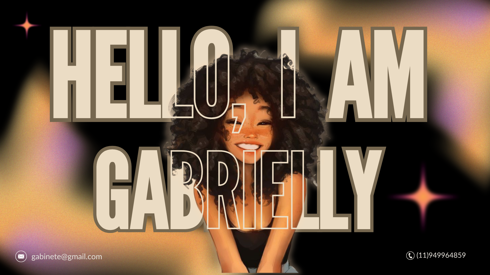

  
   
<table align="center">
  <tr>
    <!-- Coluna da imagem -->
    <td width="40%" align="center">
      
    </td>
<!-- Coluna do texto -->
    <td width="60%" align="left">
      <h3 align="center">Sobre mim</h3>
      

        Sou desenvolvedora em formação, apaixonada por tecnologia e
        focada no desenvolvimento de aplicações web e mobile.
        Tenho experiência com projetos acadêmicos e pessoais,
        sempre buscando aprender e evoluir.
      

    </td>
  </tr>
</table>

  

 

<!-- 

  

 -->

 

## 🚀 Tecnologias

### 🎨 Frontend

  
  
  
  

### ⚙️ Backend

  
  
  

### 📱 Mobile & Linguagens

  
  
  
  

### 🗄️ Banco de Dados

  
  

## 🌐 Contato

  
  

 

  Buscando sempre evoluir, aprender e transformar ideias em soluções. 👾

